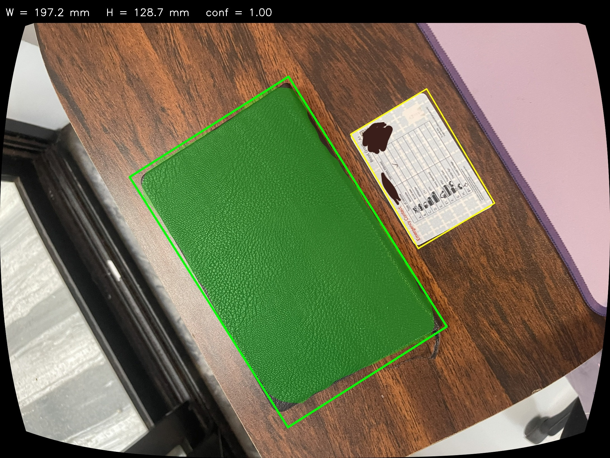
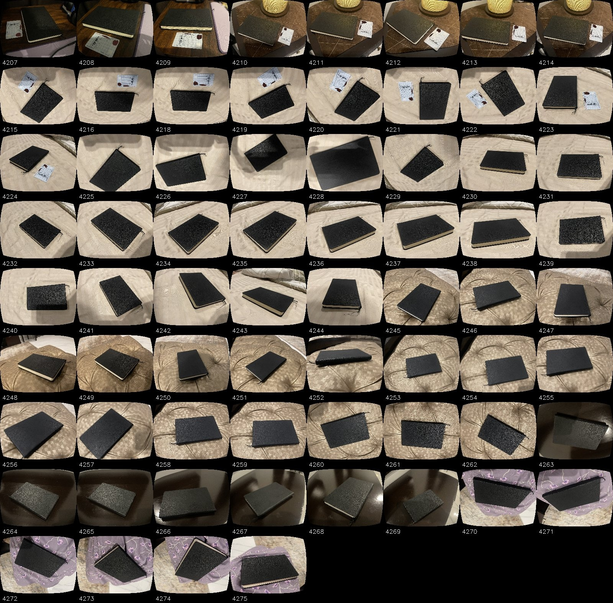

# Vision-metric

End-to-end pipeline that measures the real-world width and height (mm) of a notebook from a single phone photo.

Built for the XIS AI/CV technical assessment.

## What it does

Four steps:

1. **Calibrate** the iPhone 12 Pro Max main lens using a checkerboard displayed fullscreen on a laptop screen. Mean per-image reprojection error: 0.085 px.
2. **Undistort** every image using the recovered intrinsics before any measurement is taken.
3. **Segment** the notebook with a Mask R-CNN (ResNet-50 FPN, COCO-pretrained, fine-tuned on 48 self-collected images). Best validation mask IoU: 0.96.
4. **Measure** in mm using a credit/ID card (ISO/IEC 7810 ID-1, 85.60 x 53.98 mm) as a known-size reference. The user clicks the 4 card corners; a homography handles camera tilt.

Why Mask R-CNN and not YOLO/Roboflow: the assessment forbids both. Mask R-CNN is well-supported in `torchvision` with COCO pretraining that transfers cleanly to a small single-class dataset. More in `docs/training-report.md`.

## Headline numbers

| | result |
|---|---|
| Calibration mean reprojection error | 0.085 px |
| Mask R-CNN best val IoU | 0.9606 |
| Measurement (overhead, N=19): width MAE / MPE | 23.6 mm / 13.1% |
| Measurement (overhead, N=19): height MAE / MPE | 14.2 mm / 11.4% |

The measurement error is dominated by a systematic over-estimate caused by notebook thickness (~20 mm) vs the card plane. See `docs/measurement-report.md` for the diagnosis and the fixes that would actually help.

## Example output

End-to-end result on one image. Notebook mask in green, card box in yellow, predicted dimensions in the top label bar.



The black curved border is from `cv2.undistort` with `alpha=1.0`, which retains all source pixels (the curve is the geometric inverse of the lens's barrel distortion). The calibration before/after and training curves are in their respective reports under `docs/`.

### Dataset

68 raw photos of the same notebook on varied backgrounds, lighting, and angles:



## Quick start

```
python -m venv .venv
.venv\Scripts\activate
pip install -r requirements.txt

# end-to-end demo on one image (you'll click 4 card corners, ENTER)
python inference/demo.py --image dataset/raw/IMG_4326.JPG.jpeg --out docs/figures/demo_output.jpg
```

See `SETUP.md` for the full setup, including the Python version note (torch wheels target 3.9-3.12; on 3.13/3.14 you need a separate venv for training).

## Repo layout

```
calibration/   checkerboard generator, calibration script, intrinsics.npz
dataset/       raw + undistorted images, splits, COCO annotations
models/        training script, training_log.csv (best.pt produced by training)
inference/     end-to-end demo
measurement/   pixel -> mm pipeline, validation script, ground_truth.csv, results.csv
notebooks/     Colab notebook used for training on a free GPU
docs/          all reports + figures
```

## Reports

- `docs/architecture.md` - end-to-end data flow diagrams (offline setup + online measurement)
- `docs/calibration-report.md` - method, K, distortion, reprojection error
- `docs/dataset-card.md` - what was collected, how it was labelled, splits
- `docs/training-report.md` - model choice, hyperparameters, loss + IoU curves
- `docs/measurement-report.md` - pipeline, accuracy table, parallax limitation
- `docs/api.md` - public function signatures, inputs/outputs, sample usage
- `docs/design-decisions.md` - choices made, alternatives considered, trade-offs
- `SETUP.md` - installation and full run order

## Notes

- **Weights not committed.** `best.pt` is 176 MB; `.gitignore` excludes `*.pt`. Re-train in ~3 minutes on a Colab T4 via `notebooks/train_colab.ipynb`.
- **One iPhone, one notebook.** The model and the calibration are specific to one device and one notebook style. Re-running on a different phone needs a fresh calibration; a different notebook style needs more labelled data.
