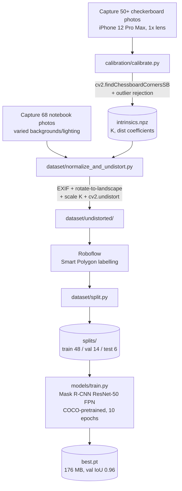
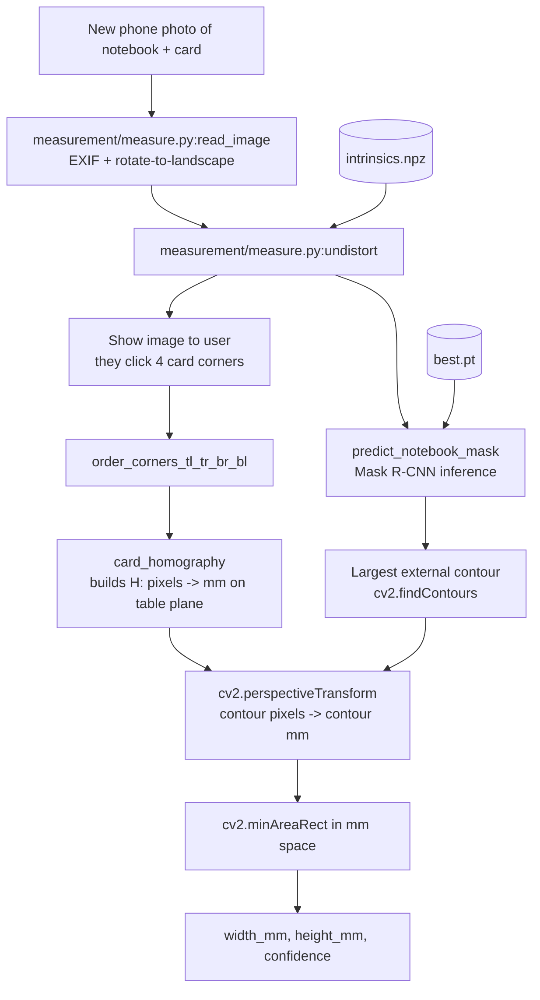

# Pipeline Architecture

End-to-end data flow for the measurement pipeline. Two separate flows: an offline *setup* flow that runs once per camera/dataset, and an online *measurement* flow that runs per photo.

## Offline setup (run once)

**Outputs of setup:**
- `calibration/intrinsics.npz` - camera parameters (K matrix, distortion coefficients)
- `models/checkpoints/best.pt` - trained Mask R-CNN weights

## Online measurement (per photo)

**Per-photo outputs:**
- `width_mm`, `height_mm` - long and short sides of the rotated rectangle in millimetres
- `confidence` - Mask R-CNN's mask score (0-1)
- Annotated overlay JPEG (via `inference/demo.py`)

## Why the steps are in this order

1. **Undistort first**, before anything else, so all subsequent pixel measurements are spatially uniform across the frame. Skipping it injects 1-5% error that varies with object position.
2. **Click the card before running the model** - there's no benefit to waiting for inference; the card click is the bottleneck the user experiences.
3. **Project mask contour points through the homography *first*, then fit a rectangle** - fitting in pixel-space first and then converting only the rectangle corners would measure an axis-aligned bounding box of the projected (foreshortened) shape, not the true rectangle. Doing the projection first lets `minAreaRect` operate in true on-plane mm coordinates.
4. **`minAreaRect` instead of axis-aligned `boundingRect`** - the notebook can be at any rotation in the photo; we want the tight rotated rectangle, not an axis-aligned one.

## Data shapes / units at each stage

| Stage | Variable | Shape / units |
|---|---|---|
| Raw input | `img_bgr` | (H, W, 3) uint8 BGR |
| After undistort | `und` | (H, W, 3) uint8 BGR |
| Card corners (clicked) | `corners` | (4, 2) float32 pixels |
| Homography | `H` | (3, 3) float64 |
| Mask | `mask` | (H, W) uint8 {0, 1} |
| Mask contour pixels | `contour_px` | (N, 1, 2) float32 pixels |
| Mask contour mm | `pts_mm` | (N, 2) float32 mm |
| Final rect | `rect_mm` | ((cx, cy), (w, h), angle) in mm |
| Output | `width_mm`, `height_mm` | float (long side, short side) |

## Coordinate frames

- **Photo frame** (pixels) - origin top-left, +x right, +y down. Distorted in raw input, undistorted after step 2.
- **Card plane / table plane** (mm) - origin at the card's TL corner after homography, +x along the card's long side, +y along its short side. The notebook contour, projected through `H`, lives in this frame.

This is the frame the final `minAreaRect` measures in, which is why the output is in mm without any further scaling.
