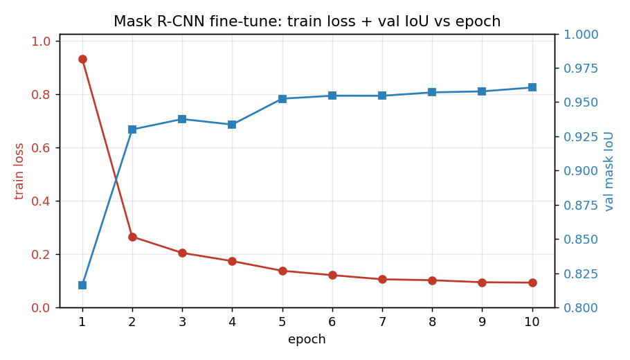
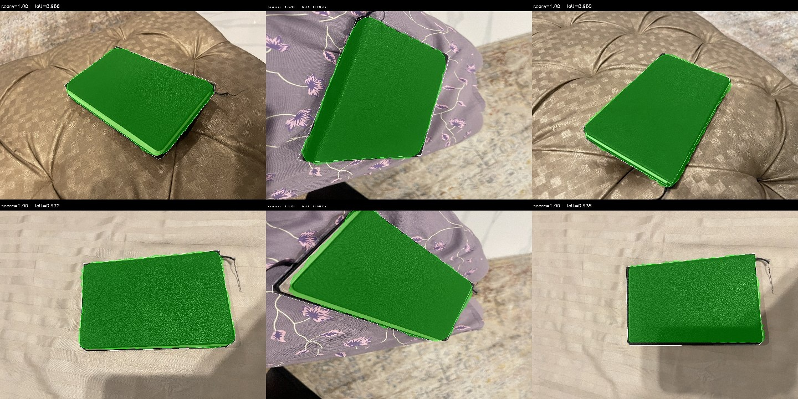

# Training Report

## Model

`torchvision.models.detection.maskrcnn_resnet50_fpn`, COCO-pretrained. The box predictor and the mask predictor are both replaced with fresh heads sized for 2 classes (background + notebook). Everything else (backbone, RPN, ROI pooling) is loaded from the COCO weights and fine-tuned.

### Why Mask R-CNN

The assessment forbids YOLO/Ultralytics and Roboflow models, which rules out the easiest path. Among what's left:

- **Mask R-CNN** is well-supported in `torchvision`, gives instance masks directly (one mask per detected object, with a confidence score), and the COCO-pretrained backbone transfers cleanly to small datasets. Good fit for a single-class, ~50 image fine-tune.
- **DeepLabV3+ / U-Net** are semantic segmentation, which collapse all instances of a class into one mask. For our pipeline that doesn't matter (one notebook per photo) but it complicates downstream work and gives you no per-instance score.
- **SAM2 fine-tune** is heavy and adds a lot of moving parts for no obvious accuracy gain on a flat rectangular object.

So Mask R-CNN was the obvious starting point.

## Hyperparameters

| Hyperparameter | Value |
|---|---|
| Optimizer | SGD, momentum 0.9, weight decay 5e-4 |
| Learning rate | 5e-3 |
| LR schedule | StepLR, step_size=4, gamma=0.5 |
| Batch size | 4 (Colab T4) |
| Epochs | 10 |
| Augmentation | random horizontal flip (50%) |
| Image input | torchvision default (shorter side 800, longer side capped at 1333) |
| Random seed | 42 |
| Hardware | Colab free-tier T4 GPU |

Training took ~3 minutes total on the T4 (~17 seconds per epoch).

## Results

Best **val mask IoU = 0.9606**, reached at epoch 10. Final train loss 0.0934.

Per-epoch numbers from `models/checkpoints/training_log.csv`:

| epoch | train loss | val IoU | seconds |
|------:|-----------:|--------:|--------:|
|   1   |    0.9332  |  0.8161 |  17.7   |
|   2   |    0.2655  |  0.9300 |  16.3   |
|   3   |    0.2050  |  0.9376 |  15.8   |
|   4   |    0.1741  |  0.9336 |  16.8   |
|   5   |    0.1379  |  0.9525 |  16.1   |
|   6   |    0.1214  |  0.9547 |  16.7   |
|   7   |    0.1059  |  0.9546 |  17.2   |
|   8   |    0.1024  |  0.9571 |  17.5   |
|   9   |    0.0949  |  0.9578 |  18.0   |
|  10   |    0.0934  |  0.9606 |  17.8   |



The loss drops cleanly and val IoU is monotonic from epoch 5 onward. Epoch 4 dipped slightly on val (0.934 vs 0.938 at epoch 3), which is the only non-monotonic step. After the first LR drop at epoch 5 it climbs steadily.

No sign of overfitting in 10 epochs - train loss is still falling at the end and val IoU is still rising. Could probably squeeze out another point or two of IoU with another 5-10 epochs and a second LR drop, but 0.96 is already well past the threshold where the mask quality matters for measurement (the dominant error source downstream is parallax, not mask precision).

## Test-set metrics

Evaluated on the held-out 6-image test split (never seen during training) with `models/eval_test.py`. Score threshold 0.5, IoU threshold 0.5 for precision/recall.

| Metric | Value |
|---|---:|
| segm mAP@0.5:0.95 | 0.9554 |
| segm mAP@0.5      | 1.0000 |
| bbox mAP@0.5:0.95 | 0.9215 |
| bbox mAP@0.5      | 1.0000 |
| Precision         | 1.0000 |
| Recall            | 1.0000 |
| F1                | 1.0000 |
| TP / FP / FN      | 6 / 0 / 0 |

The model detects the notebook in every test image with IoU well above 0.5, so precision and recall are both 1.0. The harder COCO metric `mAP@0.5:0.95` averages over IoU thresholds 0.5 to 0.95 in 0.05 steps; segm score 0.955 there means the masks are tight, not just present.

Predicted masks (green) on the 6 test images:



Per-image overlays are in `docs/figures/test_predictions/`. White outlines = ground truth, green fill + outline = prediction. All 6 land at IoU > 0.9.

> **Data note.** Roboflow labelled some images in their EXIF-rotated display orientation while the raw JPEGs are stored in pre-rotation orientation (14 of 68 images affected). `eval_test.py` calls `ImageOps.exif_transpose` to align the image to the polygon space before inference. Training (`models/train.py`) did not apply this and still reached val IoU 0.96, so the model handled it OK, but this is a real data-integrity issue worth fixing in a future iteration.

## Reproducing

Local (CPU works but slow):

```
python models/train.py --data-dir dataset/splits --epochs 10 --batch-size 2
```

Colab (recommended): open `notebooks/train_colab.ipynb`, runtime > T4 GPU, run all cells. The notebook uploads `train_bundle.zip` (made from `dataset/splits_small/`), trains, and downloads `best.pt` and `training_log.csv` back to your machine.

## Files

```
models/
  train.py                       # the training script (also runs in Colab)
  checkpoints/
    best.pt                      # 176 MB; not committed to git
    training_log.csv             # per-epoch loss, val IoU, seconds
notebooks/
  train_colab.ipynb              # Colab wrapper that calls train.py
```

> **Note on weights.** `best.pt` is 176 MB and is excluded by `.gitignore` (`*.pt`). Training is reproducible from the notebook in ~3 minutes on a free Colab T4, so we ship the recipe rather than the weights.
